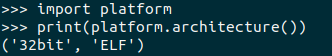

## __Como ejecutar un programa de 32 bits en una arquitectura de 64 bits__
### Instalar python2.7 para 32 bits:
```
sudo apt install python2.7:i386 
```
### Crear un entorno virtual:
```
sudo apt-get update
sudo apt-get install virtualenv
virtualenv -p /usr/bin/python2.7 myenv32 --system-site-packages
```
### Para ejecutar el entorno virtual:
```
source myenv32/bin/activate
```
### Test para verificar que se este ejecutando en una arquitectura de 32 bits:
```
python
import platform 
print(platform.architecture())
```
Debe mostrar algo como lo siguiente:



### Al ejecutar el programa de python en el entorno por primera vez se debe ejecutar el siguiente comando:
```
pip install requests
```
### Para salir del entorno virtual:
```
deactivate        
```